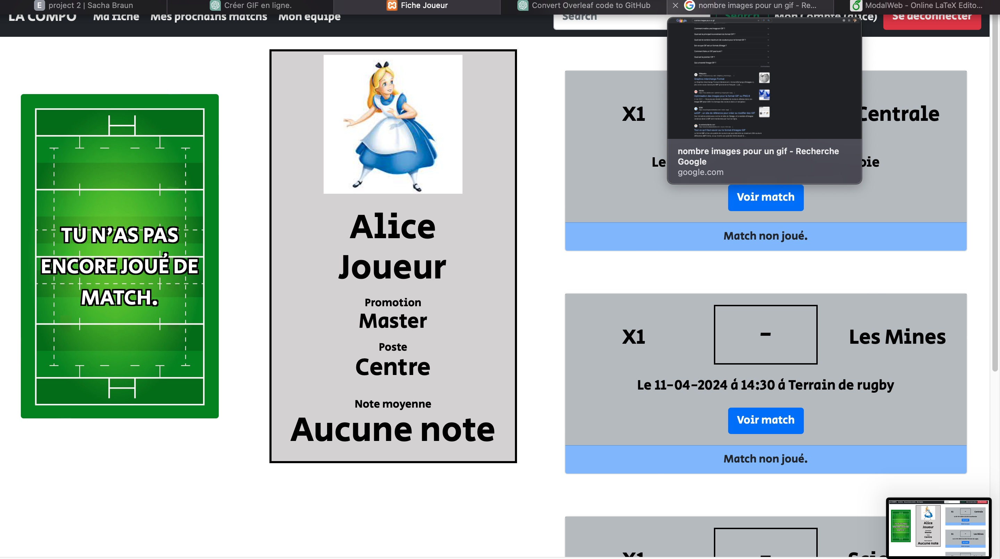

**Authors**

Axel Navarro and Sacha Braun

**Date**

24/02/2022

**Introduction**

LA COMPO is a website designed to assist rugby coaches in team management, specifically in setting up the team lineup for upcoming matches and giving performance feedback to players after the matches. The website is built using PHP and JavaScript and runs on a XAMPP server. It interfaces with a MySQL database for data persistence.

**How to Run the Project**

1. Install XAMPP on your computer. It is a free and open-source cross-platform web server solution stack package developed by Apache Friends, consisting mainly of the Apache HTTP Server, MariaDB database, and interpreters for scripts written in the PHP and Perl programming languages. You can download it from https://www.apachefriends.org/index.html.

2. Once installed, copy the entire LA COMPO project folder into the 'htdocs' directory of your XAMPP installation.

3. Start the Apache and MySQL modules using the XAMPP control panel.

4. In your web browser, navigate to http://localhost/ followed by the directory name of your project. For example, if you copied the project into a directory named 'lacompoweb', you would navigate to http://localhost/lacompoweb.

5. To access the MySQL database, navigate to http://localhost/phpmyadmin in your web browser.

**User Roles**

LA COMPO has two main user roles: player and coach.

**Player:**

A player is a basic user on the site, representing a member of the rugby team. The player's attributes include their usual position, class year, email, date of birth, profile picture, and login information. A player can view their upcoming matches, player profile, average rating, and the profiles of their teammates. They can also edit their account information.

**Coach:**

A coach acts as an administrator for the site, with the ability to modify the database outside of login information. They can schedule new matches, set team lineups, update match scores, rate players' performance in each match, delete matches, and edit a player's usual position. They can also view all player profiles. To create a coach profile, validation from another administrator, such as the Director of Sports, is required.

**Database Structure**

The MySQL database comprises four tables:

1. `players`: Contains all users attached to the Player class, with each player recognized by their unique login (which is the primary key).

2. `coaches`: Contains all users attached to the Coach class, with each coach also recognized by their unique login (the primary key).

3. `matches`: Stores information about each rugby match, with a unique `idMatch` as the primary key.

4. `matchPlayerRecord`: Links the previous tables, recording which players participate in which matches. This table uses a composite primary key comprising `idMatch` and `login`.

**Features and Functionality**

**Creating a Match:**

Coaches can use a drag-and-drop interface to create new matches, dragging player names from a list onto positions on a rugby field. Once the lineup is set, the coach can finalize the match, which sends automatic email notifications to all selected players.

**Managing Teams and Matches:**

Once a match is created, it's visible to all users, who can view the lineup and access player profiles. Coaches can edit or delete matches as necessary.

**Giving Player Feedback:**

After a match, the coach can enter the final score and rate each player's performance on a scale of 1-10. This data isthen stored in the database for future reference.

**Conclusion**

LA COMPO is a versatile tool for rugby team management, allowing coaches to efficiently set lineups, manage matches, and provide feedback to players. The user-friendly interface, combined with the comprehensive functionality, makes it a valuable resource for any rugby coach.
